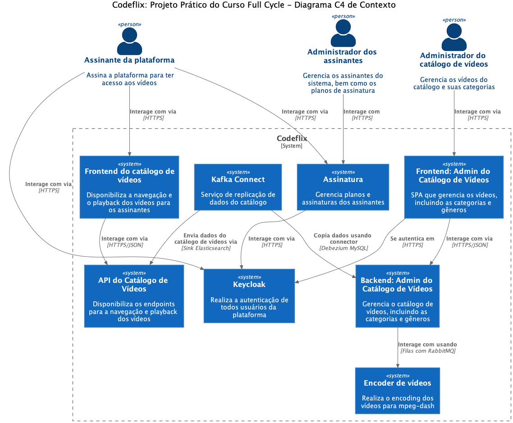
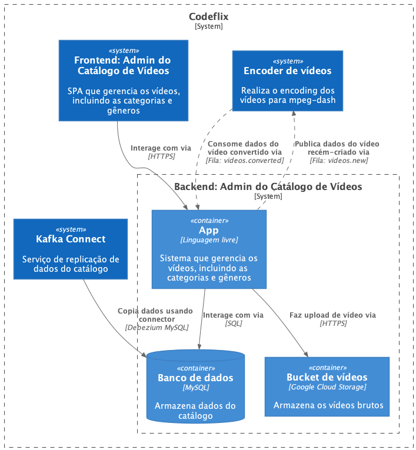

# microserviço, backend: Admin catalogo de vídeo - Codeflix 

### c4 model



---

### caracteristica do projeto
- microserviço da parte administrativa do catalogo de video
- typescript, javascript
- clean architecture, domain driven design, solid, conceitos da arquitetura de microserviços, design patterns
- piramide de testes, tdd
- framework backend: nestjs
- spa: frontend conversa com o backend de administração de video
- api rest
- storage - google cloude storage - assets(imagens, videos)
- sincronizando dados usando kafka connect
- comunicação assincrona com rabbitmq
- construir o nucleo primeiro e deixar o mais puro possivel
    - manter livre de tecnologia
    - mantivel ao longo do tempo e independente de tecnologia
    - consigo trocar os frameworks com essa estrategia, ex: nestjs, express, banco
    - uncle bob - framework é detalhe
- utlizando conceitos de uma modelagem mais rica, facilita o entendimento da arquitetura em camadas do software de forma mais madura
- ddd: domain driven design
  - design tatico
    - entidade, objeto de valor, repository

----
### etapas de construção da aplicação backend
- Montagem do ambiente de desenvolvimento (Docker e IDE)
- modelar o core(regras de negocio, ...) antes de ir para o framework nestjs, usando ddd e clean archtecture
- criar uma pasta shared(logica compartilhavel)
- Criar uma aplicação TypeScript (core)
  - Criar entidade de Categoria
  - Criar testes (pirâmide de testes)
    - unitario, integração
  - Criar Casos de Uso e Repositório
  - Nest.js - Criação de API Rest
  - Criar testes e2e (end-to-end)
  - Repetir para as outras entidades, cast member, genre, video
- Integração com RabbitMQ e Encoder de vídeo
- keycloak
- logs
  - rastrear comportamento
- CI
  - esteira no github actions
  - docker file para produção
      - imagem menor, otimizada
      - vai ser usada no cd

---
### generico
- config: carregar variveis de ambiente com dotenv
  - criei suportando configurações alem do .env, assim respeitando twelve-factory - chapter 3
  - normalmente o dotenv é usado apenas em desenvolvimento para carregar variáveis de ambiente locais, não em produção, onde variáveis já devem estar definidas no ambiente do servidor/container.
- /core: contem as principais operações do dominio, com poucas influencia do nestjs
- class-transformer
  - usado na serialização do output do controller
- class-validator
  - usado no core e no controller para validar entradas

----
### clean architecture
  - interface adapters
    - presenters
      - categoryOuput, collection, pagination
    - controllers
      - category, cast-member
    - gateways
      - repository
  - application business rules
    - usecases
      - category
        - Create: Criação de uma nova categoria.
        - Update: Atualização de uma categoria existente.
        - Delete: Remoção de uma categoria.
        - Get: Recuperação de uma categoria específica.
        - Search/List: Listagem e busca de categorias.
      - castmembers
  - enterprise business rules
    - category, castmembers
  - dependencias apontam para o centro
----

### database, persistence
  - repository 
    - search(filter, sort, paginate), crud
  - inmemory
  - orm: sequelize
    - mysql, sqlite
    - design pattern - active record
  - mapper
  - migration
    - umzug
      - src/core/shared/infra/db/sequelize/migrator.ts
      - comando
        - mostra as funcionalidades disponiveis do umzug
        - dev
          - npm run migrate:ts
        - produção
          - npm run migrate:js
---

### api rest
- recursos
  - categories
  - genres
  - cast members
  - videos
---
### hexagonal - ports and adapters
- gateway no usecase
  - port: ICategoryRepository
  - adapter: CategorySequelizeRepository, CategoryInMemoryRepository
- controller
  - port/adapter: api rest
- port: validator-fields-interface.ts
  - validate domain
- port: repository-interface.ts
---
### solid
- srp
  - usecase: execute, validação input
  - repository: mapper, helper
- open/closed principle (OCP):
  - class-validator: validação da entidade
  - IRepository, ISearchableRepository
  - SearchParams
- liskov substitution principle (LSP):
  - garantir que subclasses possam substituir as superclasses sem alterar a corretude do comportamento do sistema
- interface segregation
  - IRepository e ISearchableRepository separados
- d: dependecy inversion
  - usecase
    - constructor
      - repository
  - repository
    - constructor
      - sequelize
---
### DDD
  - entities
    - category
      - é qualquer agrupamento de elementos com características em comum, usado para classificar, organizar ou estruturar informações, objetos ou conceitos.
    - cast-members
      - "membro do elenco", uma pessoa (ator, atriz, diretor, etc.) que faz parte da produção de um filme, série ou peça.
  - object value
    - uuid, search-params, search-result, cast-member-type
  - repository
    - category
    - cast-member
  - aggregate
  - commit sem nestjs: 73137dbf9f8a561f3be342723fb982a4cdd73ec3

---

### validações, tratamento de erros
  - validações
    - separação das validações de dominio(regras de dominio) vs validações de sintaxe
    - class-validator
      - categoryRules
      - CastMemberRules
    - joy validator
      - configModule - variaveis de ambiente
    - nest - pipe
  - tratamento de erros, lançamento de exceções
    - either - tratar de forma explicita, alternativa ao throw
    - erros na entidade com notification pattern(acumular erros e no final fazer algo no usecase)
    - nest - filters
    - exceptions especificas inves de new Error generic
  
---

### configurações de qualidade
- Configuração de Qualidade (QA)
  - ferramentas de qualidade para garantir a integridade do código, assegurando cobertura de testes e tipagem correta.
- typescript (tipagem)
  - Criado um script NPM chamado tsc:check que execute o compilador do TypeScript apenas para verificação (sem gerar build), garantindo que não existam erros de tipagem no projeto.
- jest (teste)
  - cobertura de testes
    - Configurado o Jest para que a execução falhe caso a cobertura de código (code coverage) seja inferior a 80%.
    - foi usado apenas para o teste de integração e unidade
    - npm run test:cov
- eslint (regras de código)
- prettier (formatação automatica baseada nas regras)

---
### testes
- tdd(test driven development), triple aaa(arrange, act, assert), piramidade de testes
- Test Data Builder(Gof - criacional)
  - CategoryFakeBuilder
- fluent pattern
  - ValidatorRules
- helpers/setup test sequelize
- fixtures (configuração para teste, arranges)
  - teste de integração, e2e
- quantidade de testes:
  - unidade: 76
  - integração: 1
----

### nestjs

- versão da cli: @nestjs/cli@10.1.17

- inicializa um novo projeto
  - nest new nest
    - select: npm
- novo modulo
  - npx nest g module shared
- pipe
  - validação com class-validator
- interceptor
  - class-transform para transformar a data para toIsoString
  - envolver saida do category get com a propriedade data
- filter
  - tratar execeções do dominio
    - o campo name não pode ter mais de 255 caracters, criar entidade e notification
    - not found id no usecase, repository update
- helper
  - test
    - startApp - inicia modulo, banco para o teste e2e
- nest-modules/shared-module

----
### docker
- como está organizado a config do docker?
- docker-compose.yml
  - usa tmpfs
  - tmpfs
    - util para teste
    - carrega pasta do mysql na memoria ram
- docker-compose.dev.yml
  - util para desenvolvimento
  - usa volumes inves de tmpfs, quando reiniciar o container não perde a pasta
  - foi usado pq devcontainer não esta reconhecendo !reset do tmpfs do docker-compose.override.yaml, se reconhece-se era só descomentar .example do override para poder mudar de ambiente.
- docker-compose.overvire.yaml
  - usaria isso com docker-compose.yml se o devcontainer reconhece-se !reset
- devcontainer.json.example
  - por padrão está configurando para usar docker-compose.yml
----
### como rodar o projeto

- instalar o docker
- como executar como dev container?
  - criar devcontainer.json baseado no ./devcontainer/devcontainer.json.example
    - posso escolher a opção dockercomposefile dentro do arquivo devcontainer.json para apontar para:
      - docker-compose.yaml: tmpfs mysql - modo test
        - por padrão está em modo test
      - docker-compose.dev.yaml: volume mysql -> modo dev
  - instalar extensão dev container
    - abrir command pallete: ctrl + shift + p 
    - digitar > dev container
    - escolher: reopen in container
- como executar o projeto sem dev container?
  - instalar extensoes vscode
    - devcontainer
    - eslint
      - regra de codigo
    - pretty
      - formatar
    - jest
      - botão no codigo
      - icones de quimica - arvore de testes
      - executa apenas o teste isolado
      - jest
        - orta.vscode-jest
      - jest runner
        - firsttris.vscode-jest-runner
    - rest client
      - testar api com o arquivo api.http e com npm run start:dev
  - comandos
    - iniciar ambiente
      - docker compose -f docker/docker-compose.yml up
    - acessar container
      - docker exec -it fc3-codeflix-backend-admin-catalogo bash
- escolhendo entre modo test ou desenvolvimento
  - executar em modo test
    - teste de unidade, integração
      - criar /envs/.env.test com base no .env.test.example
        - sqlite inmemory
      - npm run test
    - teste end-to-end(e2e)
      - criar /envs/.env.e2e com base no .env.e2e.example
      - usar docker-compose.yaml
        - mysql em memoria
      - npm run test:e2e:runInBand
        - os testes foram projetos para funcionar só de forma sequencial para não dar conflito ao mudar o mesmo schema
  - executar em modo dev
    - criar /envs/.env com base no .env.example
      - sqlite inmemory
    - usar docker-compose.dev.yaml
      - mysql com volume mapeado
    - executar em modo dev
      - npm run start:dev
  - eu posso mudar o banco via .env* ou nos tests via config-module
- testando a api com rest client extension + /api.http
  - npm run start:dev
  - executar chamadas do /api.http

### comandos
```bash
# tests
npm run test
npm run test — — watch

# coverage html - teste de unitade e integração
npm run test:cov

# rebuild se alterar manifesto
docker compose -f docker/docker-compose.yml up --build

# analise estatica do typescript sem gerar build
 npm run tsc:check

# migration umzug
- observaçao
  - usou .env com mysql e DB_AUTO_LOAD_MODELS=false, false evita conflito com o array de models carregados na inicialização nest
  - provavelmente as migrations vão ter um utilidade maior em produção
- mostra as funcionalidades disponiveis do umzug
  - dev
    - npm run migrate:ts
  - produção
    - npm run migrate:js
- ver funcionalidades disponiveis do create
  npm run migrate:ts create -- --help

- cria migration
  - dar um nome sugestivo, do que está sendo feito
  - mover para a pasta do modulo correspondente
  npm run migrate:ts create -- --name create-categories-table.ts --folder ./src

- mostra migrations pendentes
  - npm run migrate:ts pending
- aplica migrations pendentes
  - npm run migrate:ts up
- desfaz; suporta steps
  - npm run migrate:ts down

# container mysql, comandos uteis
mysql -uroot -proot
use micro_videos;
show tables;
drop table categories;
describe categories;
select * from SequelizeMeta;

```

---
projeto pai:
[Link para o projeto pai](https://github.com/iamfelipy/fc3-codeflix-netflix)